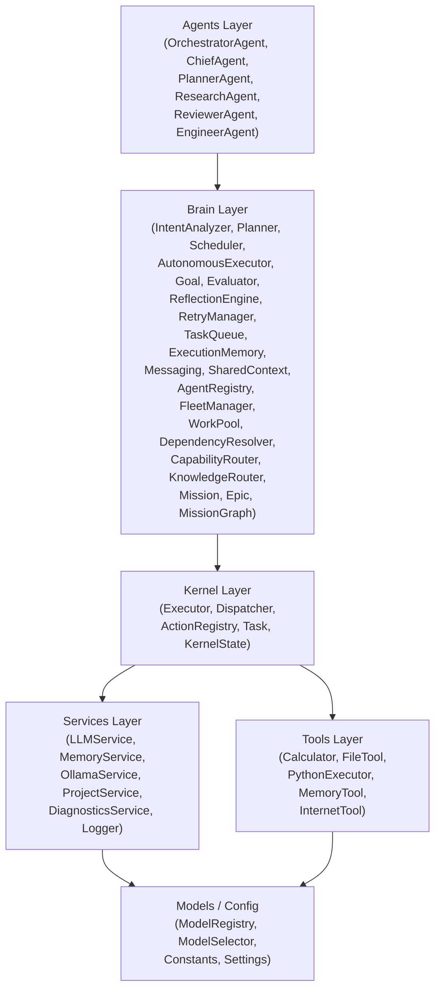
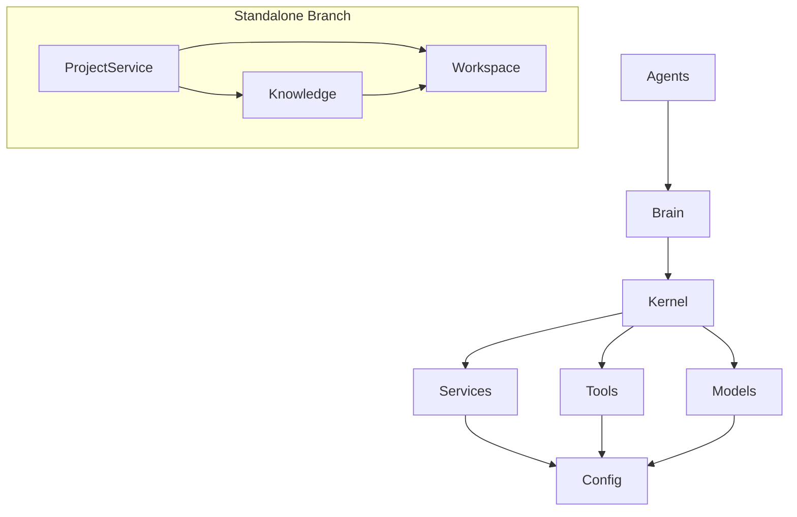
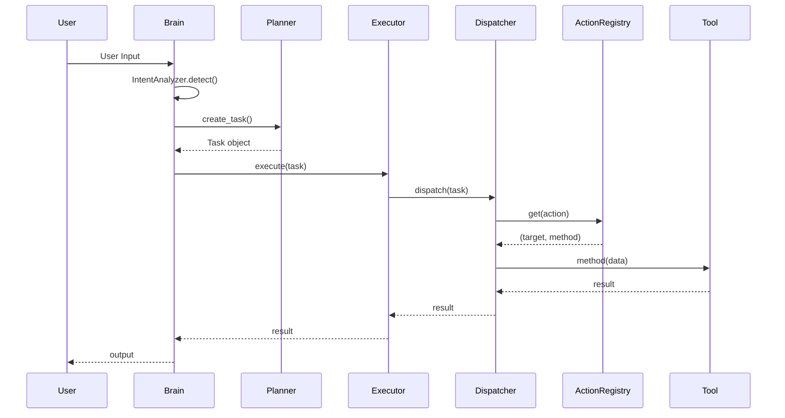
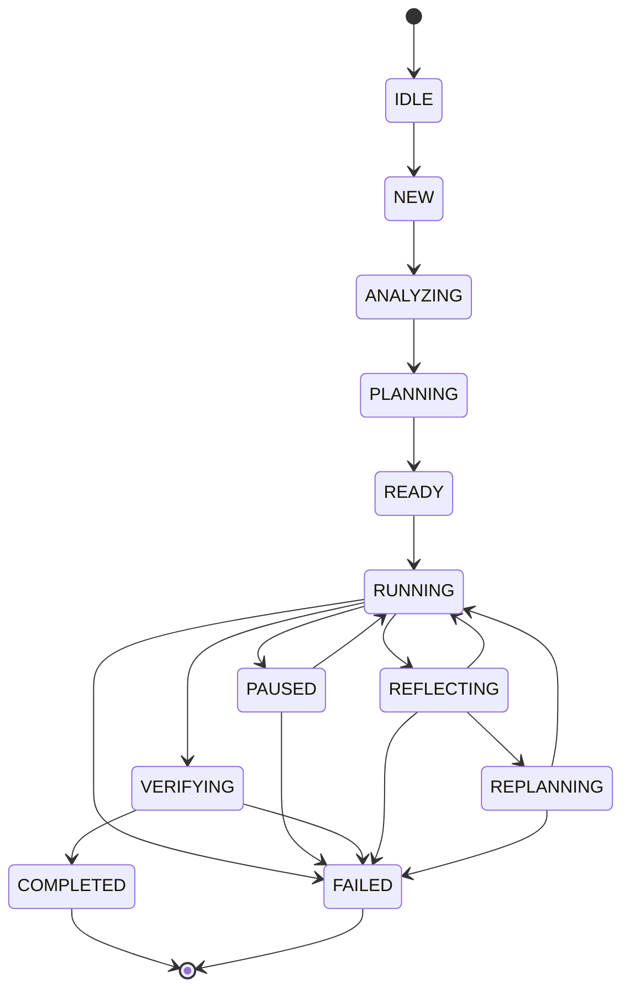
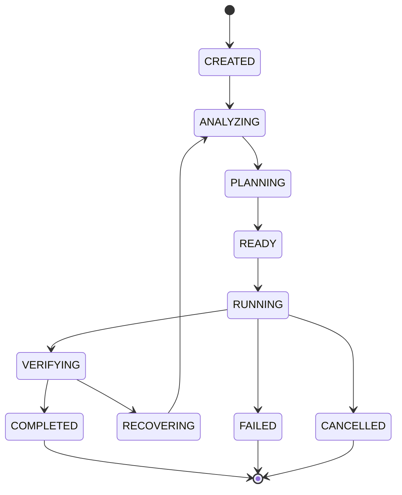
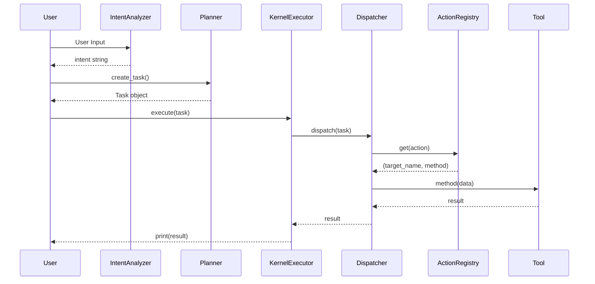
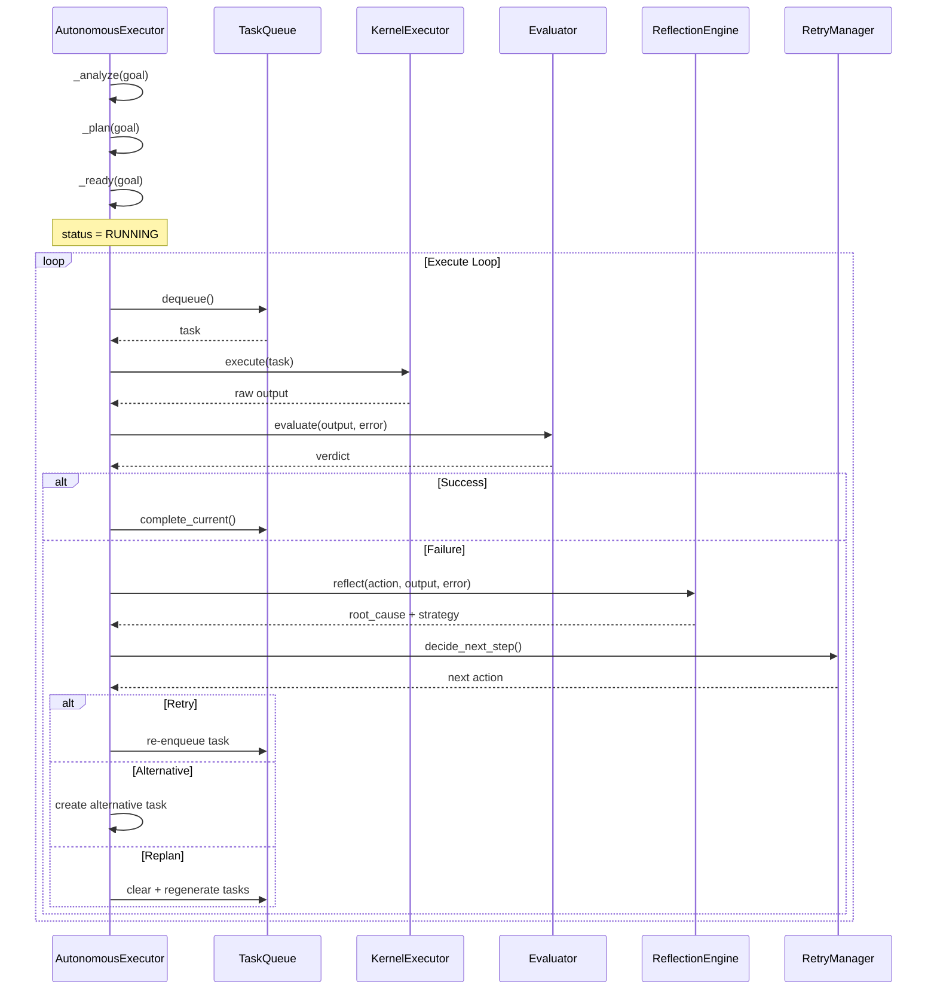
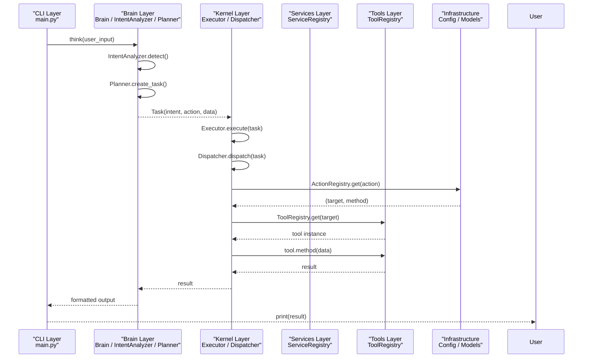
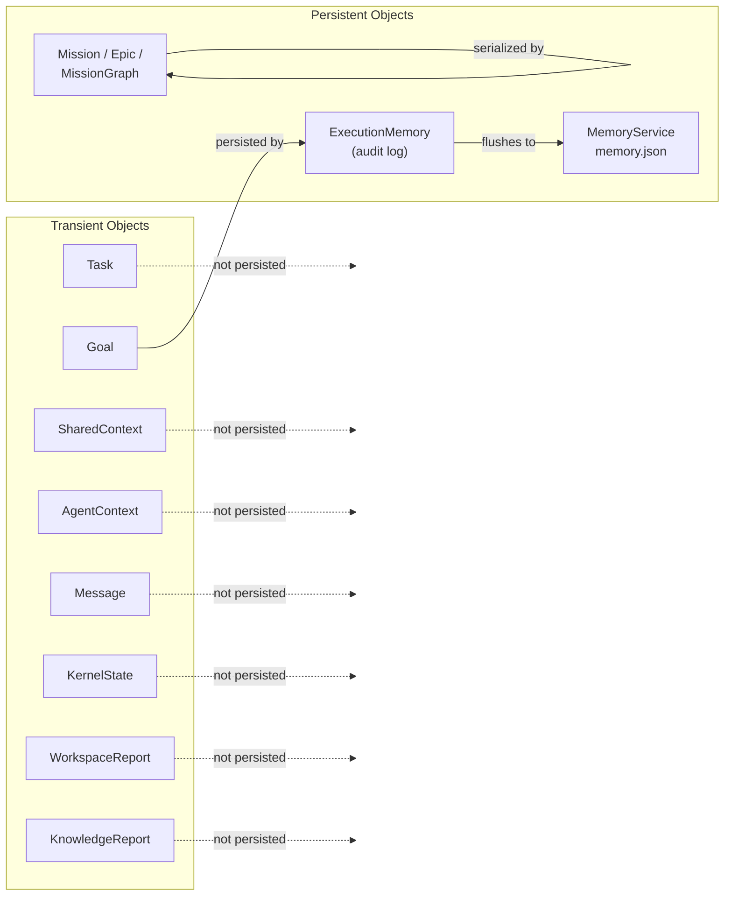

# AMALGAM Architecture

Version: 1.0
Status: Active

This document is the official technical architecture reference for AMALGAM.
It documents only what currently exists in the repository.

---

## 1. System Overview

AMALGAM is an Artificial Intelligence Operating System built as a layered
modular Python application. It coordinates multiple AI agents, manages tools,
persists memory, builds knowledge graphs, and executes autonomous goal-driven
workflows through a deterministic pipeline.

The system runs on Windows via PowerShell and uses Ollama as its LLM backend.

Key architectural decisions — including trade-offs, rejected alternatives, and
rationale — are recorded in DECISIONS.md (companion document).

---

## 2. Architecture Principles

AMALGAM is governed by ten permanent architecture principles that every
component and contribution must respect. These are derived from the
Core Architecture Principles and Engineering Principles defined in
AGENTS.md and DECISIONS.md.

| # | Principle | Description |
|---|-----------|-------------|
| 1 | Architecture Before Implementation | Never write code without understanding where it belongs. Architecture decisions precede implementation. |
| 2 | Reuse Before Creation | Search existing code before creating new modules. Extend existing abstractions. Duplication is forbidden. |
| 3 | Layer Separation | Each layer has exactly one responsibility. Responsibilities must never leak across layers. |
| 4 | Composition Over Inheritance | Prefer composing small reusable components. Avoid deep inheritance trees. |
| 5 | Deterministic Behaviour | Identical inputs must produce identical outputs whenever practical. Avoid hidden randomness and implicit global state. |
| 6 | Small Incremental Changes | Large rewrites are forbidden. Implement features in small, reviewable milestones. Every milestone must leave the repository working. |
| 7 | Backward Compatibility | Existing public APIs must continue working. New capabilities must be additive. Breaking changes require explicit approval. |
| 8 | Mission-First Development | Every feature belongs to a Mission. Never implement unrelated features during another Mission. |
| 9 | Test Before Completion | A task is not complete until tests pass, existing tests continue passing, and no regressions exist. |
| 10 | Repository Is Source of Truth | Never assume or invent architecture. Always inspect existing code before making design decisions. |

---

## 3. Design Philosophy

### Long-Term Autonomy

AMALGAM is an engineering operating system, not a chatbot or an LLM wrapper.
Every design decision prioritizes long-term autonomous operation over short-term
convenience. Short-term compromises that weaken long-term architecture are
rejected. (See DECISIONS.md for trade-off records.)

### System Over Agent

The system architecture takes precedence over any individual agent or model.
Components are designed to be model-agnostic and replaceable. No single agent
failure should halt the system.

### Explicit Over Implicit

Data flow, state transitions, and error handling are explicit. Implicit global
state, hidden side effects, and silent error swallowing are prohibited.

### Layered Isolation

Each layer owns a clearly scoped responsibility and communicates only through
defined boundaries. Cross-layer shortcuts are forbidden. This ensures that any
layer can be replaced or upgraded independently. Layer boundaries are enforced
by the import DAG documented in Section 21 (Import Rules).

### Determinism by Default

Non-deterministic behaviour must be explicitly documented and justified.
Identical inputs should produce identical outputs to enable reliable testing,
debugging, and recovery.

### Security by Construction

Security boundaries are enforced at the architectural level — not bolted on after
implementation. Workspace isolation, dispatch routing, and input sanitization
are built into the layer contracts. The current security posture and gaps are
documented in Section 25 (Security Boundaries).

### Incremental Over Perfect

Progress is made through small, verifiable milestones. Each milestone leaves the
system in a working state. Large rewrites and speculative generality are
avoided.

---

## 4. High Level Architecture

```
┌──────────────────────────────────────────────────────────┐
│                       Agents                             │
│  (OrchestratorAgent, PlannerAgent, ResearchAgent,        │
│   ReviewerAgent, EngineerAgent, ChiefAgent)              │
└──────────────────────┬───────────────────────────────────┘
                       │  imports from
┌──────────────────────▼───────────────────────────────────┐
│                       Brain                              │
│  (IntentAnalyzer, Planner, Scheduler, Router,            │
│   AutonomousExecutor, Goal, Evaluator, ReflectionEngine, │
│   RetryManager, TaskQueue, ExecutionMemory,              │
│   Messaging, SharedContext, AgentRegistry, FleetManager, │
│   WorkPool, DependencyResolver, CapabilityRouter,        │
│   KnowledgeRouter, Mission, Epic, MissionGraph)          │
└──────────────────────┬───────────────────────────────────┘
                       │  imports from
┌──────────────────────▼───────────────────────────────────┐
│                      Kernel                              │
│  (Executor, Dispatcher, ActionRegistry, Task, KernelState)│
└──────────────────────┬───────────────────────────────────┘
                       │  imports from
┌──────────────────────▼───────────────────────────────────┐
│             Services          │          Tools            │
│  (LLMService, MemoryService,  │  (Calculator, FileTool,  │
│   OllamaService,              │   PythonExecutor,        │
│   ProjectService,             │   MemoryTool,            │
│   DiagnosticsService,         │   InternetTool)          │
│   Logger)                     │                          │
└──────────────────────┬───────────────────────────────────┘
                       │  imports from
┌──────────────────────▼───────────────────────────────────┐
│                  Config / Models                          │
│  (constants, settings, models, version)                  │
└──────────────────────────────────────────────────────────┘
```

### Mermaid Representation



---

## 5. Layered Architecture

| Layer | Directory | Responsibility |
|-------|-----------|----------------|
| Agents | `agents/` | Multi-agent pipeline coordination |
| Brain | `brain/` | Intent detection, planning, scheduling, autonomous execution, mission management |
| Kernel | `kernel/` | Task dispatch, action routing, kernel lifecycle |
| Services | `services/` | LLM, memory, project, diagnostics, logging infrastructure |
| Tools | `tools/` | Filesystem, code execution, calculator, memory, internet |
| Models | `models/` | Model registry and selection |
| Config | `config/` | Constants, settings, version metadata |
| Workspace | `workspace/` | Read-only project metadata (standalone leaf) |
| Knowledge | `knowledge/` | Code intelligence (documents, symbols, relationships, graph) |

---

## 6. Repository Structure

```
C:\AMALGAM\
├── main.py                  # Entry point: Brain → Executor REPL
├── pyproject.toml           # Project metadata (v0.3.0)
├── requirements.txt         # Python dependencies
├── AGENTS.md                # AI operating manual
├── ARCHITECTURE.md          # This document
├── MISSION.md               # Mission specification (empty)
├── TASK.md                  # Current task specification (empty)
├── ROO.md                   # Development rules
├── AI_RULES/                # Global engineering rules
│
├── agents/                  # Multi-agent system
│   ├── base_agent.py        # Abstract BaseAgent
│   ├── chief_agent.py       # Adaptive mission orchestration
│   ├── orchestrator_agent.py # Pipeline coordinator
│   ├── planner_agent.py     # Goal & plan creation
│   ├── research_agent.py    # Context gathering
│   ├── reviewer_agent.py    # Safety & quality checks
│   ├── engineer.py          # Autonomous execution backend
│
├── brain/                   # Core intelligence
│   ├── brain.py             # think() → intent → plan → Task
│   ├── router.py            # Model selection by keyword
│   ├── orchestrator.py      # Legacy direct processing
│   ├── messaging.py         # Inter-agent message bus
│   ├── scheduler.py         # Pipeline execution
│   ├── shared_context.py    # Thread-safe blackboard
│   ├── agent_registry.py    # Agent discovery
│   ├── agent_context.py     # Per-agent private state
│   ├── fleet_manager.py     # Agent lifecycle & health
│   ├── work_pool.py         # Capability-aware task queue
│   ├── dependency_resolver.py # Task DAG scheduler
│   ├── capability_router.py # Load-aware routing
│   ├── knowledge_router.py  # Topic-based context filtering
│   ├── constants.py         # Centralized keyword sets
│   ├── session.py           # Session manager (placeholder)
│   ├── intent/intent.py     # IntentAnalyzer
│   ├── planner/planner.py   # Task builder
│   ├── executor/autonomous_executor.py  # Goal lifecycle engine
│   ├── goal/goal.py         # Goal state machine
│   ├── evaluator/evaluator.py          # Result validation
│   ├── reflection/reflection_engine.py  # Failure analysis
│   ├── retry/retry_manager.py           # Bounded retry
│   ├── queue/task_queue.py   # FIFO task queue
│   ├── memory/execution_memory.py       # Execution audit log
│   ├── pipeline/pipeline.py  # Preprocessor pipeline
│   ├── preprocessor/preprocessor.py     # Input normalizer
│   ├── tools/tool_router.py  # Plan-to-tool routing
│   ├── mission/mission.py    # Mission dataclass
│   ├── mission/mission_id.py # UUID4 identifier
│   ├── mission/mission_priority.py      # Priority enum
│   ├── mission/mission_status.py        # State machine
│   ├── mission/epic.py       # Mission grouping
│   ├── mission/graph.py      # DAG + topological sort
│
├── kernel/                  # Execution kernel
│   ├── executor.py          # Boot + dispatch
│   ├── dispatcher.py        # Action routing
│   ├── action_registry.py   # Action→target mapping
│   ├── task.py              # Task dataclass
│   ├── state.py             # Kernel boot state
│
├── services/                # Infrastructure services
│   ├── logger.py            # Structured logging
│   ├── llm.py               # Ollama chat wrapper
│   ├── ollama_service.py    # Ollama health
│   ├── memory.py            # JSON-persistent KV store
│   ├── project_service.py   # Project summarization
│   ├── diagnostics.py       # Health checks
│   ├── service_registry.py  # Service registration
│
├── tools/                   # Capability tools
│   ├── base_tool.py         # Abstract tool
│   ├── calculator.py        # Math eval
│   ├── python_executor.py   # Python exec sandbox
│   ├── file_tool.py         # File CRUD
│   ├── memory_tool.py       # Remember/recall
│   ├── internet_tool.py     # Web search
│   ├── tool_registry.py     # Tool registration
│
├── models/                  # Model management
│   ├── registry.py          # Model registry
│   ├── selector.py          # Plan→model mapping
│
├── config/                  # Configuration
│   ├── constants.py         # All runtime constants
│   ├── settings.py          # Runtime settings
│   ├── models.py            # Model names
│   ├── version.py           # Build metadata
│
├── workspace/               # Read-only project introspection
│   ├── workspace.py         # Public API
│   ├── scanner.py           # File scanner
│   ├── analyzer.py          # Metadata analysis
│   ├── tree.py              # Directory tree
│   ├── project.py           # Dataclasses
│   ├── summary.py           # Report summary
│   ├── git.py               # Git info
│   ├── dependency.py        # Dependency parsing
│
├── knowledge/               # Code intelligence
│   ├── engine.py            # Orchestrator
│   ├── documents.py         # Document scanning
│   ├── parser.py            # AST parsing
│   ├── symbols.py           # Symbol extraction
│   ├── relationships.py     # Import relationships
│   ├── graph.py             # Node/edge graph
│   ├── index.py             # Lookup indexes
│   ├── search.py            # Search APIs
│   ├── report.py            # KnowledgeReport dataclass
│
├── tests/                   # 70 test files, 406 tests
│
├── storage/                 # Persistence
│   ├── memory/memory.json   # Key-value store
│   ├── cache/               # Empty
│   ├── embeddings/          # Empty
│   ├── knowledge/           # Empty
│
├── docs/                    # Documentation
│   ├── Architecture.md      # Legacy (102 lines)
│   ├── Changelog.md         # Change log
│   ├── Development.md       # Dev guidelines
│   ├── missions/            # Mission docs (all empty)
│
├── builder/                 # Scaffolding (placeholder)
├── cli/                     # CLI dispatcher
├── plugins/                 # Empty
├── modules/                 # Empty
├── apps/                    # Empty
├── voice/                   # Empty
├── vision/                  # Empty
├── scripts/                 # Empty
├── data/                    # Empty
├── assets/                  # Empty
├── logs/                    # Empty
```

---

## 7. Layer Responsibilities

| Layer | Owns | Imports From | Imported By |
|-------|------|-------------|-------------|
| Agents | OrchestratorAgent, ChiefAgent, PlannerAgent, ResearchAgent, ReviewerAgent, EngineerAgent | `brain/*`, `tools/*`, `config` | Nothing |
| Brain | IntentAnalyzer, Planner, Scheduler, AutonomousExecutor, Goal, Evaluator, Reflection, Retry, TaskQueue, ExecutionMemory, Messaging, SharedContext, AgentRegistry, FleetManager, WorkPool, DependencyResolver, CapabilityRouter, KnowledgeRouter, Mission, Epic, MissionGraph | `kernel/*`, `services/*`, `models/*`, `config` | `agents/*` |
| Kernel | Executor, Dispatcher, ActionRegistry, Task, KernelState | `tools/*`, `services/*`, `models/*`, `config` | `brain/*` |
| Services | LLMService, MemoryService, OllamaService, ProjectService, DiagnosticsService, Logger | `workspace/*`, `knowledge/*`, `models/*`, `config` | `kernel/*`, `brain/*` |
| Tools | Calculator, FileTool, PythonExecutor, MemoryTool, InternetTool | `services/*`, `config` | `kernel/*` |
| Models | ModelRegistry, ModelSelector | `config` | `brain/*`, `kernel/*` |
| Config | Constants, Settings, Models, Version | Nothing | Everything |
| Workspace | Scanner, Analyzer, Tree, Git, Dependency | Nothing | `services/project_service.py`, `knowledge/engine.py` |
| Knowledge | Engine, Documents, Parser, Symbols, Relationships, Graph, Index, Search, Report | `workspace/*` | `services/project_service.py` |

---

## 8. Dependency Direction

```
agents/
  ↓
brain/
  ↓
kernel/
  ↓
services/  tools/  models/
  ↓
config/
```

Standalone branch:

```
services/project_service.py
  →  workspace/          (leaf — imports nothing from project)
  →  knowledge/
      →  workspace/      (workspace never imports knowledge)
```

No circular dependencies exist in the 130+ module import graph.

### Mermaid Representation



---

## 9. Execution Pipeline

### Primary Runtime Flow (CLI)

```
User Input
  │
  ▼
input("You: ")
  │
  ▼
brain.brain.Brain.think()
  ├── IntentAnalyzer.detect(text)  →  intent string
  └── Planner.create_task(intent, text)  →  Task object
  │
  ▼
kernel.executor.Executor.execute(task)
  │
  ▼
kernel.dispatcher.Dispatcher.dispatch(task)
  ├── ActionRegistry.get(action)  →  (target_name, method_name)
  ├── ToolRegistry.get(target)    →  tool instance (preferred)
  └── ServiceRegistry.get(target) →  service instance (fallback)
      │
      ▼
  Tool/Service.method(task.data)  →  result
      │
      ▼
  print(result)  ─── user sees output
```

### Mermaid Sequence (Primary Flow)



### Multi-Agent Pipeline

```
OrchestratorAgent.execute(task)
  │
  ▼
OrchestratorAgent.run(ctx)
  │
  ▼
Scheduler.run_pipeline([planner, researcher, reviewer, engineer], ctx)
  │
  ├── PlannerAgent.run(ctx)     →  creates Goal, generates plan
  ├── ResearchAgent.run(ctx)    →  gathers context (memory, files, project, web)
  ├── ReviewerAgent.run(ctx)    →  validates plan safety and quality
  └── EngineerAgent.run(ctx)    →  delegates to AutonomousExecutor
      │
      ▼
  EngineerAgent.execute(task)
      │
      ▼
  AutonomousExecutor.run(description)
```

---

## 10. Autonomous Goal Lifecycle

### State Machine

```
    ┌─────────┐
    │  IDLE   │
    └────┬────┘
         │
    ┌────▼────┐
    │  NEW    │
    └────┬────┘
         │
    ┌────▼────────┐
    │  ANALYZING  │
    └────┬────────┘
         │
    ┌────▼────────┐
    │  PLANNING   │
    └────┬────────┘
         │
    ┌────▼───────┐
    │   READY    │
    └────┬───────┘
         │
    ┌────▼───────┐
    │  RUNNING   │◄──────────────────────────┐
    └────┬───────┘                           │
         │                                   │
    ┌────▼──────────┐    ┌──────────────┐    │
    │  VERIFYING    │    │  REFLECTING  │────┤
    └────┬──────────┘    └──────┬───────┘    │
         │                      │            │
    ┌────▼──────────┐    ┌──────▼───────┐    │
    │  COMPLETED    │    │  REPLANNING  │────┘
    └───────────────┘    └──────┬───────┘
                               │
                          ┌────▼───────┐
│  FAILED    │
└────────────┘
```

### Mermaid State Diagram



### Valid Transitions

| From | To |
|------|----|
| IDLE | NEW |
| NEW | ANALYZING |
| ANALYZING | PLANNING |
| PLANNING | READY |
| READY | RUNNING |
| RUNNING | VERIFYING, REFLECTING, FAILED, PAUSED |
| PAUSED | RUNNING, FAILED |
| VERIFYING | COMPLETED, FAILED |
| REFLECTING | REPLANNING, RUNNING, FAILED |
| REPLANNING | RUNNING, FAILED |
| COMPLETED | (terminal) |
| FAILED | (terminal) |

### Goal Dataclass

```python
Goal(id, description, priority, status, created_at, updated_at,
     plan, plan_version, result, error, metadata)
```

### Execution Loop

```
_analyze(goal)     →  ANALYZING
_plan(goal)        →  PLANNING, generate plan
_ready(goal)       →  READY, create tasks
_execute_loop(goal)→  RUNNING
  while not terminal:
    dequeue task
    execute via KernelExecutor
    evaluate via Evaluator
    if success: complete
    if failure: reflect → retry | alternative | replan | fail
    if queue empty: verify → COMPLETED | FAILED
```

---

## 11. Mission Architecture

### Mission State Machine

```
CREATED → ANALYZING → PLANNING → READY → RUNNING → VERIFYING → COMPLETED
                                                              ↓
                                                         RECOVERING → ANALYZING
                                                                   → ... → RUNNING
                                                              ↓
                                                          FAILED / CANCELLED
```

### Mermaid State Diagram



### Key Classes

| Class | File | Purpose |
|-------|------|---------|
| `Mission` | `brain/mission/mission.py` | Metadata dataclass with lifecycle |
| `Epic` | `brain/mission/epic.py` | Groups related Missions |
| `MissionGraph` | `brain/mission/graph.py` | DAG for dependency management |
| `MissionID` | `brain/mission/mission_id.py` | UUID4 identifier |
| `MissionPriority` | `brain/mission/mission_priority.py` | LOW, NORMAL, HIGH, CRITICAL |
| `MissionStatus` | `brain/mission/mission_status.py` | 9-state lifecycle enum |
| `MissionNode` | `brain/mission/graph.py` | Graph node wrapper |
| `MissionDependency` | `brain/mission/graph.py` | Immutable edge (frozen dataclass) |

### Graph Operations

- `add_mission(mission)` — insert node
- `remove_mission(mission)` — remove node and edges
- `add_dependency(source, target)` — add directed edge with cycle detection
- `remove_dependency(source, target)` — remove edge
- `topological_sort()` — Kahn's algorithm, O(V + E)
- `has_cycle()` — cycle detection
- `validate()` — edge/node consistency + acyclic check
- `roots()` / `leaves()` — terminal node queries

---

## 12. Agent Architecture

### BaseAgent

Every agent extends `BaseAgent` (`agents/base_agent.py`):

| Property/Method | Purpose |
|-----------------|---------|
| `name` | Unique agent identifier |
| `status` | idle, ready, running, completed, failed |
| `_context` | `AgentContext` — private isolated state |
| `_shared` | `SharedContext` — cross-agent blackboard |
| `_messaging` | `Messaging` — message bus for inter-agent communication |
| `setup()` | Lifecycle hook (→ ready) |
| `run(ctx)` | Abstract — primary logic |
| `teardown()` | Lifecycle hook (→ idle) |
| `send_message()` | Send to specific agent or broadcast |
| `receive_messages()` | Retrieve pending messages |

### Agent Fleet

| Agent | Class | File | Role |
|-------|-------|------|------|
| OrchestratorAgent | `OrchestratorAgent` | `agents/orchestrator_agent.py` | Pipeline coordinator |
| ChiefAgent | `ChiefAgent` | `agents/chief_agent.py` | Adaptive mission orchestration |
| PlannerAgent | `PlannerAgent` | `agents/planner_agent.py` | Goal + plan creation |
| ResearchAgent | `ResearchAgent` | `agents/research_agent.py` | Context gathering |
| ReviewerAgent | `ReviewerAgent` | `agents/reviewer_agent.py` | Safety/quality validation |
| EngineerAgent | `EngineerAgent` | `agents/engineer.py` | Autonomous execution |

### Pipeline Execution

```
Scheduler.run_pipeline(agent_names, shared_context)
  for name in agent_names:
    agent = registry.get(name)
    result = agent.run(shared_context)
    shared_context.set(f"result_{name}", result)
    if result.get("success") == False:
      halt, propagate error
```

### WorkPool (ChiefAgent)

Capability-based distributed task queue:

- `submit_task(task, capability)` — enqueue by capability
- `steal_task(agent, capabilities)` — dequeue matching capability (work stealing)
- `complete_task(task_id)` — mark done, broadcast completion
- `fail_task(task_id, error)` — mark failed, broadcast failure
- `requeue_task(task_id)` — return to front of queue

### FleetManager

- `register(agent, capabilities)` — add agent to fleet
- `report_health(agent, metrics)` — update load/status
- `get_fleet_state()` — snapshot all agents
- `reap_dead_agents(timeout)` — remove stale agents

---

## 13. Memory Architecture

### MemoryService (`services/memory.py`)

JSON-persistent key-value store on disk:

```
storage/memory/memory.json
```

| Method | Purpose |
|--------|---------|
| `remember(key, value)` | Store key-value, persist to JSON |
| `recall(key)` | Retrieve value by key |
| `forget(key)` | Remove key |
| `show_all()` | All stored memories |
| `load()` | Load JSON file at startup |
| `save()` | Flush to JSON file |

### ExecutionMemory (`brain/memory/execution_memory.py`)

Audit log for autonomous execution steps:

| Method | Purpose |
|--------|---------|
| `record(goal_id, step, ...)` | Log execution step |
| `recall(goal_id)` | All records for a goal |
| `recall_latest(goal_id)` | Most recent record |
| `flush()` | Batch write to MemoryService |

Each record contains:

- goal_id, step, timestamp
- goal, plan, task, action
- output, error, reflection

---

## 14. Knowledge Architecture

### KnowledgeEngine (`knowledge/engine.py`)

Build process:

```
Workspace.report()  →  project root + scan paths
  │
  ▼
DocumentReader.read(root)  →  documents (from docs/, spec/)
  │
  ▼
SymbolIndex.build(root, paths)  →  module/class/function symbols
  │
  ▼
RelationshipBuilder.build(root, paths, packages)  →  import relationships + package hierarchy
  │
  ▼
KnowledgeGraph.build(symbols, relationships)  →  nodes + edges
  │
  ▼
KnowledgeReport(documents, symbols, relationships, graph, summary)
```

### DocumentReader

Scans for `.md`, `.rst`, `.txt` files in `docs/` and `spec/` directories plus
root `README.*` files. Extracts title from first heading.

### PythonParser

Uses `ast` module to extract:

- Classes (with methods)
- Functions (module-level and async)
- Module names (from `__init__.py` package resolution)
- Imports (`import X`, `from X import Y`)

### Search

| Method | Ordering |
|--------|----------|
| `search_symbols(query)` | class (0) → function (1) → module (2) |
| `search_documents(query)` | By match count descending |
| `search_relationships(query)` | Linear scan by source/target/type |

---

## 15. Tool Architecture

### ToolRegistry (`tools/tool_registry.py`)

Eagerly instantiates all tools at startup:

| Tool | Name | Class | File | Methods |
|------|------|-------|------|---------|
| Calculator | `calculator` | `Calculator` | `tools/calculator.py` | `calculate(expression)` |
| PythonExecutor | `python` | `PythonExecutor` | `tools/python_executor.py` | `execute(code)` |
| FileTool | `files` | `FileTool` | `tools/file_tool.py` | `read`, `write`, `list_dir`, `exists`, `backup`, `append`, `delete`, `copy`, `move`, `replace_text` |
| MemoryTool | `memory` | `MemoryTool` | `tools/memory_tool.py` | `remember(key, value)`, `recall(key)` |
| InternetTool | `internet` | `InternetTool` | `tools/internet_tool.py` | `search(query)` |

### BaseTool

All tools inherit from `BaseTool` (`tools/base_tool.py`):

```python
class BaseTool:
    name = "base"
    def execute(self, *args, **kwargs):
        raise NotImplementedError
```

### ActionRegistry Routing

| Action Constant | Tool/Service | Method |
|----------------|--------------|--------|
| `ACTION_CALCULATE` | calculator | `calculate` |
| `ACTION_RUN_PYTHON` | python | `execute` |
| `ACTION_LIST_FILES` | files | `list_dir` |
| `ACTION_REMEMBER` | memory | `remember` |
| `ACTION_RECALL` | memory | `recall` |
| `ACTION_SEARCH_WEB` | internet | `search` |
| `ACTION_PROJECT_SUMMARY` | project_service | `summarize` |
| `ACTION_CHAT` | llm_service | `ask` |
| `ACTION_GENERATE_CODE` | llm_service | `ask` |

---

## 16. Service Architecture

### ServiceRegistry (`services/service_registry.py`)

| Service | Name | Class | File |
|---------|------|-------|------|
| LLMService | `llm` | `LLMService` | `services/llm.py` |
| MemoryService | `memory` | `MemoryService` | `services/memory.py` |
| OllamaService | `ollama` | `OllamaService` | `services/ollama_service.py` |
| ProjectService | `project` | `ProjectService` | `services/project_service.py` |

### LLMService

Wraps `ollama.Client.chat()`:

- Uses host from `config/settings.OLLAMA_HOST` (default `http://127.0.0.1:11434`)
- Returns `response["message"]["content"]`
- Error string on failure

### ProjectService

Bridges `workspace` and `knowledge` engines:

- Calls `Workspace(path).report()` for project metadata
- Calls `KnowledgeEngine(path).build()` for code intelligence
- Returns combined summary (root, packages, documents, symbols, relationships)

### DiagnosticsService

Runs health checks for:

- Configuration completeness
- Memory service loading
- Tool registry population
- Service registry population
- Ollama availability
- Storage directory state

---

## 17. Shared Context

### SharedContext (`brain/shared_context.py`)

Thread-safe blackboard for all agents in a pipeline:

| Method | Purpose |
|--------|---------|
| `get(key, default)` | Read value |
| `set(key, value)` | Write value + record history |
| `update(dict)` | Batch write + record history |
| `snapshot()` | Shallow copy of all state |
| `record(event)` | Append audit event |
| `get_history()` | Full mutation history |
| `clear()` | Reset state + history |

Implementation details:

- `__slots__` optimization (`_state`, `_history`, `_lock`)
- `Lock()` for thread safety
- `deque` for O(1) history append

---

## 18. Messaging System

### Messaging (`brain/messaging.py`)

In-memory message bus for inter-agent communication:

| Method | Purpose |
|--------|---------|
| `send(message)` | Deliver to recipient inbox (or `*` for broadcast) |
| `subscribe(agent, handler)` | Register real-time handler |
| `receive(agent)` | Retrieve and clear inbox |
| `peek(agent)` | View inbox without clearing |
| `has_messages(agent)` | Check for unread |
| `clear_inbox(agent)` | Discard pending |

### Message Dataclass

```python
Message(sender, recipient, msg_type, payload, timestamp, id)
```

Implementation details:

- `deque` per inbox for O(1) append/pop
- `_MISSING` sentinel to avoid KeyError exception flow
- Subscribe pre-allocates inbox so broadcast immediately reaches subscriber

---

## 19. Data Flow

### Task Dispatch (Request Path)

```
User Input (string)
  │
  ▼
IntentAnalyzer.detect()  ──→  intent string
  │
  ▼
Planner.create_task()     ──→  Task(intent, action, model, data)
  │
  ▼
Executor.execute()        ──→  dispatches to Dispatcher
  │
  ▼
Dispatcher.dispatch()
  ├── ActionRegistry:  action → (target_name, method)
  ├── ToolRegistry:    target_name → tool instance
  └── ServiceRegistry: target_name → service instance (fallback)
      │
      ▼
  tool.method(data)  or  service.method(data)  →  result string
      │
      ▼
  print(result)  ──→  user sees output
```

### Mermaid Sequence (Task Dispatch)



### Autonomous Execution Flow

```
Goal Description (string)
  │
  ▼
AutonomousExecutor.run()
  │
  ├── _analyze()       →  status = ANALYZING
  ├── _plan()          →  status = PLANNING, generate plan
  ├── _ready()         →  status = READY, create TaskQueue entries
  └── _execute_loop()  →  status = RUNNING
       │
       ├── TaskQueue.dequeue()  →  task dict
       ├── KernelExecutor.execute(task)  →  raw output
       ├── Evaluator.evaluate(output, error)  →  verdict dict
       ├── Success?  →  TaskQueue.complete_current()
       └── Failure?  →  Reflect → Retry | Alternative | Replan | Fail
            │
            ├── ReflectionEngine.reflect()  →  root_cause + strategy
            ├── RetryManager.decide_next_step()  →  next action
            ├── Retry: re-enqueue same task
            ├── Alternative: create alternative task
            ├── Replan: clear queue, increment plan_version, regenerate tasks
            └── Give up: mark FAILED
```

### Mermaid Sequence (Autonomous Execution)



### Inter-Agent Data Flow (Pipeline)

```
SharedContext
  ├── task: "calculate 2 + 2"
  ├── priority: 5
  │
  ├── (after PlannerAgent)
  │   ├── goal: {id, description, plan, status, ...}
  │   └── plan: "1. Extract... 2. Execute..."
  │
  ├── (after ResearchAgent)
  │   ├── research: {memory, files, project, web}
  │   └── research_summary: {task, plan, findings}
  │
  ├── (after ReviewerAgent)
  │   └── review: {approved, reason, issues}
  │
  └── (after EngineerAgent)
      ├── result_engineer: {success, task, goal, errors}
      └── error: (if failed)
```

### Cross-Layer Interaction (Full Request Lifecycle)

The following sequence diagram traces a user request across every architectural
layer — from the CLI entry point through intent analysis, planning, kernel
dispatch, tool execution, and response delivery. Each swimlane represents one
architectural layer.



---

## 20. Object Ownership

| Object | Created By | Owned By | Persisted By |
|--------|-----------|----------|-------------|
| Task | `Planner.create_task()` | Caller (Executor/Brain) | Not persisted |
| Goal | `AutonomousExecutor.run()` or `PlannerAgent.run()` | AutonomousExecutor | ExecutionMemory |
| Mission | Direct construction | Caller (via MissionGraph) | Serialization via `to_dict()`/`from_dict()` |
| Epic | Direct construction | Caller | Serialization via `to_dict()`/`from_dict()` |
| MissionGraph | Direct construction | Caller | Serialization via `to_dict()`/`from_dict()` |
| KernelState | `Executor.__init__()` | Executor | Not persisted |
| SharedContext | `OrchestratorAgent.execute()` | Scheduler during pipeline | Not persisted |
| AgentContext | `BaseAgent.__init__()` | Individual agent | Not persisted |
| Message | Any agent (via `send_message()`) | Messaging inbox | Not persisted |
| Memory records | `MemoryService.remember()` | MemoryService | `storage/memory/memory.json` |
| Execution records | `ExecutionMemory.record()` | ExecutionMemory | MemoryService (via flush) |
| WorkspaceReport | `Workspace.report()` | Caller | Not persisted |
| KnowledgeReport | `KnowledgeEngine.build()` | Caller | Not persisted |

### Mermaid Component Ownership Diagram



---

## 21. Import Rules

### Allowed Import Directions

```
agents → brain → kernel → (services, tools, models) → config

services → workspace     (leaf, no back-edge)
services → knowledge     (knowledge → workspace, but workspace never imports knowledge)
knowledge → workspace    (workspace imports nothing from project)
```

### Concrete Examples

| File | Imports From | Direction |
|------|-------------|-----------|
| `agents/engineer.py` | `tools/*`, `brain/executor/*`, `config` | agents → tools, brain, config |
| `agents/orchestrator_agent.py` | `agents/*`, `brain/*` | agents → agents, brain |
| `brain/executor/autonomous_executor.py` | `brain/*`, `kernel/*`, `config` | brain → brain, kernel, config |
| `kernel/dispatcher.py` | `kernel/*`, `tools/*`, `services/*`, `config` | kernel → tools, services, config |
| `kernel/executor.py` | `kernel/*`, `models/*`, `config` | kernel → models, config |
| `services/project_service.py` | `workspace/*`, `knowledge/*` | services → workspace, knowledge |
| `knowledge/engine.py` | `knowledge/*`, `workspace/*` | knowledge → workspace |
| `workspace/*.py` | Nothing from project | Leaf |

### Forbidden Import Patterns

| Pattern | Violation | Example |
|---------|-----------|---------|
| Services importing agents | Lower layer imports higher | `services/*` → `agents/*` |
| Tools importing brain | Lower layer imports higher | `tools/*` → `brain/*` |
| Config importing anything | Config must be leaf | `config/*` → `services/*` |
| Workspace importing knowledge | workspace must be leaf | `workspace/*` → `knowledge/*` |

---

## 22. Module Relationships

### Caller → Callee Map

| Caller | Method | Called Module |
|--------|--------|---------------|
| `main` | `brain.think()` | `Brain` |
| `main` | `executor.execute()` | `Executor` |
| `Executor.execute()` | `dispatcher.dispatch()` | `Dispatcher` |
| `Dispatcher.dispatch()` | `action_registry.get()` | `ActionRegistry` |
| `Dispatcher.dispatch()` | `tool_registry.get()` | `ToolRegistry` |
| `Dispatcher.dispatch()` | `service_registry.get()` | `ServiceRegistry` |
| `AutonomousExecutor.run()` | `kernel_executor.execute()` | `Executor` |
| `AutonomousExecutor._execute_loop()` | `evaluator.evaluate()` | `Evaluator` |
| `AutonomousExecutor._handle_failure()` | `reflection_engine.reflect()` | `ReflectionEngine` |
| `AutonomousExecutor._handle_failure()` | `retry_manager.decide_next_step()` | `RetryManager` |
| `AutonomousExecutor._execute_loop()` | `queue.dequeue()` | `TaskQueue` |
| `AutonomousExecutor._execute_loop()` | `queue.complete_current()` | `TaskQueue` |
| `AutonomousExecutor._handle_failure()` | `queue.enqueue()` | `TaskQueue` |
| `AutonomousExecutor._ready()` | `queue.enqueue()` | `TaskQueue` |
| `OrchestratorAgent._bootstrap()` | `scheduler.run_pipeline()` | `Scheduler` |
| `Scheduler.run_pipeline()` | `agent.run()` | Agent instances |
| `EngineerAgent.execute()` | `autonomous_executor.run()` | `AutonomousExecutor` |
| `ProjectService.summarize()` | `Workspace.report()` | `Workspace` |
| `ProjectService.summarize()` | `KnowledgeEngine.build()` | `KnowledgeEngine` |

---

## 23. Public APIs

### Entry Points

| Entry Point | Location | Purpose |
|-------------|----------|---------|
| `python main.py` | `main.py` | Interactive REPL |
| `python cli/main.py <command>` | `cli/main.py` | CLI command dispatcher |

### Public Classes

| Class | Module | Key Public Methods |
|-------|--------|-------------------|
| `Brain` | `brain/brain.py` | `think(user_input) → Task` |
| `IntentAnalyzer` | `brain/intent/intent.py` | `detect(text) → str` |
| `Planner` | `brain/planner/planner.py` | `create_task(intent, text) → Task` |
| `Executor` | `kernel/executor.py` | `boot()`, `execute(task) → Any` |
| `Dispatcher` | `kernel/dispatcher.py` | `dispatch(task) → Any` |
| `AutonomousExecutor` | `brain/executor/autonomous_executor.py` | `run(description) → Goal`, `progress(goal_id) → dict` |
| `Goal` | `brain/goal/goal.py` | `transition(status)`, `is_terminal()`, `is_active()`, `as_dict()` |
| `Evaluator` | `brain/evaluator/evaluator.py` | `evaluate(output, error, expected) → dict` |
| `ReflectionEngine` | `brain/reflection/reflection_engine.py` | `reflect(action, output, error) → dict` |
| `RetryManager` | `brain/retry/retry_manager.py` | `can_retry()`, `decide_next_step()`, `reset()` |
| `TaskQueue` | `brain/queue/task_queue.py` | `enqueue()`, `dequeue()`, `progress()`, `pause()`, `resume()` |
| `ExecutionMemory` | `brain/memory/execution_memory.py` | `record()`, `recall()`, `flush()` |
| `Task` | `kernel/task.py` | Dataclass (intent, action, model, tool, data) |
| `KernelState` | `kernel/state.py` | `ready()` |
| `ActionRegistry` | `kernel/action_registry.py` | `get(action) → tuple` |
| `ToolRegistry` | `tools/tool_registry.py` | `get(name)`, `list_tools()` |
| `ServiceRegistry` | `services/service_registry.py` | `get(name)`, `list_services()` |
| `BaseAgent` | `agents/base_agent.py` | `setup()`, `run(ctx)`, `teardown()`, `send_message()` |
| `OrchestratorAgent` | `agents/orchestrator_agent.py` | `execute(task) → dict`, `run(ctx) → dict` |
| `EngineerAgent` | `agents/engineer.py` | `execute(task) → dict`, `run_goal() → Goal` |
| `Scheduler` | `brain/scheduler.py` | `run_pipeline(agents, ctx) → dict`, `run_parallel()` |
| `SharedContext` | `brain/shared_context.py` | `get/set/update/snapshot/clear` |
| `Messaging` | `brain/messaging.py` | `send()`, `subscribe()`, `receive()` |
| `MemoryService` | `services/memory.py` | `remember(key, value)`, `recall(key)`, `forget(key)` |
| `LLMService` | `services/llm.py` | `ask(prompt, model) → str` |
| `ProjectService` | `services/project_service.py` | `summarize() → dict` |
| `DiagnosticsService` | `services/diagnostics.py` | `run_checks() → dict` |
| `Workspace` | `workspace/workspace.py` | `report() → WorkspaceReport`, `as_dict()` |
| `KnowledgeEngine` | `knowledge/engine.py` | `build() → KnowledgeReport`, `search_symbols()`, `search_documents()` |
| `Mission` | `brain/mission/mission.py` | `transition()`, `to_dict()`, `from_dict()` |
| `MissionGraph` | `brain/mission/graph.py` | `add_mission()`, `add_dependency()`, `topological_sort()` |
| `ChiefAgent` | `agents/chief_agent.py` | `run(ctx) → dict` |
| `DependencyResolver` | `brain/dependency_resolver.py` | `resolve(tasks) → list` |
| `WorkPool` | `brain/work_pool.py` | `submit_task()`, `steal_task()`, `complete_task()` |
| `FleetManager` | `brain/fleet_manager.py` | `register()`, `report_health()`, `get_fleet_state()` |
| `CapabilityRouter` | `brain/capability_router.py` | `route(task) → str` |
| `KnowledgeRouter` | `brain/knowledge_router.py` | `subscribe()`, `publish()`, `get_context()` |

---

## 24. Testing Architecture

### Test Suite

- **Total tests:** 406
- **Test framework:** pytest 9.1.1
- **Test files:** 70 files in `tests/`
- **Test runner:** `py -m pytest`

### Test Coverage Areas

| Area | Test Files | Tests |
|------|-----------|-------|
| Action Registry | 1 | 2 |
| Agent Context | 1 | 8 |
| Agent Registry | 1 | 5 |
| Autonomous Executor | 1 | 14 |
| Autonomous Regression | 1 | 10 |
| Base Agent | 1 | 5 |
| Brain | 1 | 3 |
| Calculator | 1 | 3 |
| Capability Router | 1 | 2 |
| Chief Agent | 1 | 1 |
| Config | 1 | 2 |
| Dependency Resolver | 1 | 4 |
| Diagnostics | 1 | 2 |
| Engineer Agent | 1 | 6 |
| Evaluator | 1 | 9 |
| Execution Memory | 1 | 5 |
| Executor | 1 | 3 |
| File Tool | 1 | 3 |
| Fleet Manager | 1 | 3 |
| Goal | 1 | 10 |
| Goal Regression | 1 | 8 |
| Intent | 1 | 4 |
| Internet Tool | 1 | 2 |
| Kernel | 1 | 1 |
| Knowledge (all) | 8 | 8 |
| Logger | 1 | 2 |
| Memory | 2 | 9 |
| Messaging | 1 | 8 |
| Mission Core | 1 | 52 |
| Mission Epic | 1 | 23 |
| Mission Graph | 1 | 47 |
| Models | 1 | 3 |
| Ollama Service | 1 | 3 |
| Orchestrator Agent | 1 | 5 |
| Pipeline | 1 | 2 |
| Planner | 1 | 17 |
| Planner Agent | 1 | 15 |
| Python Executor | 1 | 3 |
| Reflection | 1 | 8 |
| Registry | 1 | 2 |
| Research Agent | 1 | 4 |
| Retry Manager | 1 | 11 |
| Reviewer Agent | 1 | 5 |
| Scheduler | 1 | 6 |
| Service Registry | 1 | 2 |
| Shared Context | 1 | 7 |
| Task | 1 | 2 |
| Task Queue | 1 | 14 |
| Tool Router | 1 | 2 |
| Version | 1 | 1 |
| Work Pool | 1 | 3 |
| Workspace (all) | 7 | 10 |

---

## 25. Security Boundaries

### Current Security Posture

Based on Mission 6.4.3 Security Audit:

| Severity | Count | Key Findings |
|----------|-------|--------------|
| Critical | 3 | `exec()` on unsanitized input, `eval()` on user input, path traversal in FileTool |
| High | 6 | Non-cancellable timeouts, thread safety in `__del__`, prompt injection, file overwrite |
| Medium | 6 | Pause→FAILED bug, stale cache, no file locking, fragile detection |
| Low | 5 | Inconsistent API, missing validation, dead code, fragile planning |
| State Machine | 1 | Pause incorrectly forces FAILED |

### Enforced Boundaries

- **Layer isolation:** No circular imports in 130+ modules
- **Workspace read-only:** workspace package never modifies files
- **Dispatcher routing:** All tool access goes through `ActionRegistry` → `ToolRegistry`
- **Memory persistence:** Single JSON file with no concurrent access protection

### Security Gaps

- No input sanitization on user input passed to `exec()` and `eval()`
- No workspace boundary enforcement in `FileTool`
- No file locking on `memory.json`
- No cancellable task execution (timeout does not kill threads)
- No dependency allow-list for Python execution

Security-related architectural decisions and remediation planning are tracked
in DECISIONS.md.

---

## 26. Extension Points

### Existing Extension Mechanisms

| Mechanism | How To Extend |
|-----------|---------------|
| ActionRegistry | Add new route in `__init__`: `action → (tool_name, method)` |
| ToolRegistry | Instantiate new tool class, add to `self.tools` dict |
| ServiceRegistry | Instantiate new service class, add to `self.services` dict |
| IntentAnalyzer | Add new keyword frozenset and branch in `detect()` |
| Planner | Add new intent→action mapping in `create_task()` |
| AutonomousExecutor | Add new heuristic plan in `_generate_plan()` and `_create_tasks_from_plan()` |
| AgentRegistry | Register new agent instance with `register(name, agent)` |
| Scheduler | Add new agent to pipeline list |
| Evaluator | Add new error prefix in `_ERROR_PREFIXES` |
| ReflectionEngine | Add new keyword frozenset in `_classify()` |
| RetryManager | Modify `MAX_RETRY_COUNT` |
| BaseAgent | Subclass and implement `run()` |
| FileTool | Add new method following existing signatures |
| Workspace | Add new analyzer by extending `WorkspaceAnalyzer` |
| Knowledge | Add new parser by extending `PythonParser` or adding new parsers |

### Mission System Extension

| Component | File | Extension Method |
|-----------|------|------------------|
| MissionGraph | `brain/mission/graph.py` | Add new graph query methods |
| Mission | `brain/mission/mission.py` | Add new dataclass fields |
| MissionStatus | `brain/mission/mission_status.py` | Add new enum values and transition entries |

---

## 27. Future Reserved Layers

The following directories exist but are **empty** and reserved for future use:

| Directory | Intended Purpose |
|-----------|-----------------|
| `plugins/` | Plugin-based extension system |
| `modules/` | Feature modules |
| `apps/` | Application-level integrations |
| `voice/` | Voice input/output |
| `vision/` | Vision/image processing |
| `scripts/` | Utility scripts |
| `data/` | Runtime data storage |
| `assets/` | Static assets |
| `logs/` | Log output directory |
| `storage/cache/` | Cached data |
| `storage/embeddings/` | Vector embeddings |
| `storage/knowledge/` | Knowledge base data |

The `docs/missions/` directory contains 12 empty mission specification files
(`MISSION_6.6_ARCHITECTURE.md` through `MISSION_7_8.md`) that define the
planned mission structure but have not yet been populated with requirements.

`MISSION.md` and `TASK.md` at the project root are empty and intended for
active mission and task tracking.

Architecture decisions affecting future layers — including scope, priority, and
integration strategy — are recorded in DECISIONS.md.
